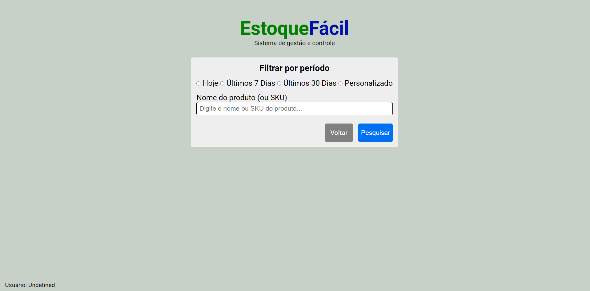

# Estoque Fácil 

**Autores**

* Rafael Ribeiro Talarico / 2022009875
* Antônio Neto / 2022011990
* José Venícius / 2022013072

Neste repositório encontra-se o código font do projeto junto a parte Front End. 

### Screenshots:

### Tela de login

### Menu principal

### Filtro de busca

### Menu de registro

### Filtro de exclusão

### Filtro de mudança

### Filtro para adicionar

### Menu de alerta de estoque

### Protótipos de base para o sistema

https://www.figma.com/file/pljn8aMyN6UI7gYWfzMsEl/rafael.talarico's-team-library?type=design&node-id=0-1&mode=design&t=HOU3Vo2JtUHIoOrv-0

https://www.figma.com/file/kE4mGQjf1iP78OZnUBTTFG/Estoque-%2B?type=design&node-id=0%3A1&mode=dev&t=a2FDWo7TbMYd2P7I-1
